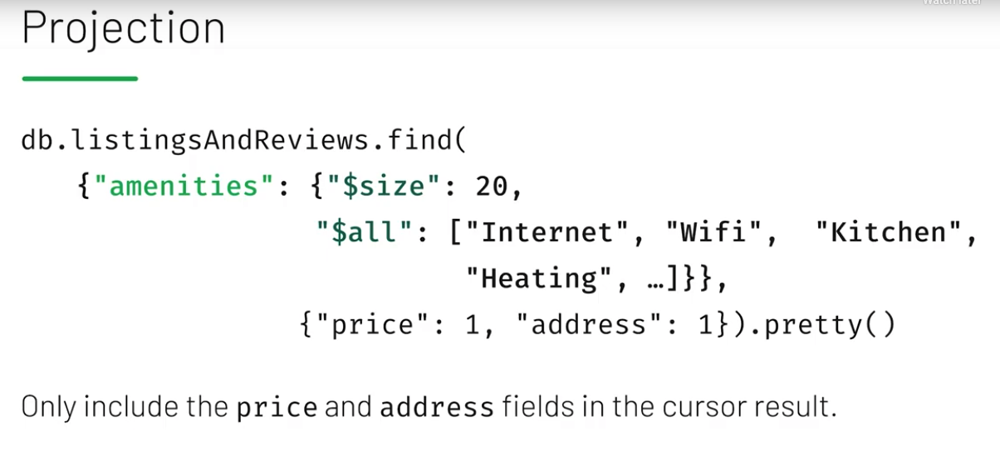

# MongoDB Cheat Sheet - adapted from [bradtraversy](https://gist.github.com/bradtraversy/f407d642bdc3b31681bc7e56d95485b6)

## Commands

### Show All Databases

```mongo
show dbs
```

### Show Collections

```mongo
show collections
```

### Show Current Database

```mongo
db
```

### Create Or Switch Database

```mongo
use notes
```

### Create Collection

```mongo
db.createCollection('posts')
```

### Insert Row

```mongo
db.posts.insert({
  title: 'Post One',
  body: 'Body of post one',
  category: 'News',
  tags: ['news', 'events'],
  user: {
    name: 'John Doe',
    status: 'author'
  },
  date: Date()
})
```

### Insert Multiple Rows

```mongo
db.posts.insertMany([
  {
    title: 'Post Two',
    body: 'Body of post two',
    category: 'Technology',
    date: Date()
  },
  {
    title: 'Post Three',
    body: 'Body of post three',
    category: 'News',
    date: Date()
  },
  {
    title: 'Post Four',
    body: 'Body of post three',
    category: 'Entertainment',
    date: Date()
  }
])
```

### Get All Rows

```mongo
db.posts.find()
```

### Find Rows

```mongo
db.posts.find({ category: 'News' })
```

### Sort Rows

```mongo
# asc
db.posts.find().sort({ title: 1 }).pretty()
# desc
db.posts.find().sort({ title: -1 }).pretty()
```

### Count Rows

```mongo
db.posts.find().count()
db.posts.find({ category: 'news' }).count()
```

### Limit Rows

```mongo
db.posts.find().limit(2).pretty()
```

### Chaining

```mongo
db.posts.find().limit(2).sort({ title: 1 }).pretty()
```

### Foreach

```mongo
db.posts.find().forEach(function(doc) {
  print("Blog Post: " + doc.title)
})
```

### Find One Row

```mongo
db.posts.findOne({ category: 'News' })
```

### Find Specific Fields

```mongo
db.posts.find({ title: 'Post One' }, {
  title: 1,
  author: 1
})
```

### Update Row

```mongo
db.posts.update({ title: 'Post Two' },
{
  title: 'Post Two',
  body: 'New body for post 2',
  date: Date()
},
{
  upsert: true
})
```

### Update Specific Field

```mongo
db.posts.update({ title: 'Post Two' },
{
  $set: {
    body: 'Body for post 2',
    category: 'Technology'
  }
})
```

### Increment Field (\$inc)

```mongo
db.posts.update({ title: 'Post Two' },
{
  $inc: {
    likes: 5
  }
})
```

### Rename Field

```mongo
db.posts.update({ title: 'Post Two' },
{
  $rename: {
    likes: 'views'
  }
})
```

### Delete Row

```mongo
db.posts.remove({ title: 'Post Four' })
```

### Sub-Documents

```mongo
db.posts.update({ title: 'Post One' },
{
  $set: {
    comments: [
      {
        body: 'Comment One',
        user: 'Mary Williams',
        date: Date()
      },
      {
        body: 'Comment Two',
        user: 'Harry White',
        date: Date()
      }
    ]
  }
})
```

### Find By Element in Array (\$elemMatch)

```mongo
db.posts.find({
  comments: {
     $elemMatch: {
       user: 'Mary Williams'
       }
    }
  }
)
```

### Add Index

```mongo
db.posts.createIndex({ title: 'text' })
```

### Text Search

```mongo
db.posts.find({
  $text: {
    $search: "\"Post O\""
    }
})
```

### Greater & Less Than

```mongo
db.posts.find({ views: { $gt: 2 } })
db.posts.find({ views: { $gte: 7 } })
db.posts.find({ views: { $lt: 7 } })
db.posts.find({ views: { $lte: 7 } })
```

## Notes from M001





